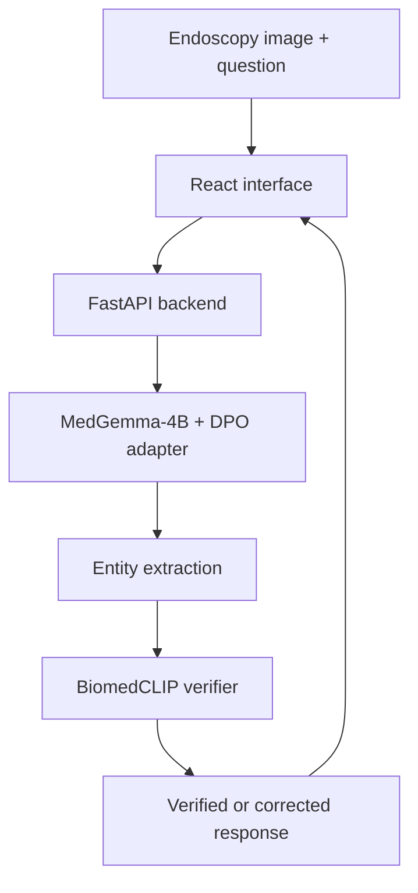

# EndoGuard

**Reducing AI hallucinations in GI endoscopy using curriculum-trained entity consistency, Direct Preference Optimization (DPO), and post-generation verification.**

EndoGuard is a research prototype for gastrointestinal endoscopy visual question answering. It combines a DPO-fine-tuned MedGemma-4B model with a BiomedCLIP-based entity verifier. The web interface supports image upload, sample-gallery analysis, follow-up questions, model comparison, entity highlighting, evaluation charts, and report generation.

> **Research-use notice:** EndoGuard is an experimental decision-support prototype. It is not a medical device and must not be used for diagnosis or patient-care decisions without validation and qualified clinical oversight.

## Demo

Add your recording at [`docs/demo/endoguard-demo.mp4`](docs/demo/endoguard-demo.mp4), then keep this link in the README:

▶️ [Watch the EndoGuard demo](docs/demo/endoguard-demo.mp4)

The recommended 60–120 second recording sequence is documented in [`docs/demo/README.md`](docs/demo/README.md).

## Main capabilities

- Analyze an uploaded GI endoscopy image or a sample from the gallery.
- Compare **DPO only** with **DPO + entity verifier**.
- Highlight mentioned, verified, flagged, and unchecked entities.
- Ask follow-up visual questions about the same image.
- Display model, system, evaluation, and curriculum-stage metrics.
- Generate a readable analysis report from the frontend.
- Run the 4-bit model and verifier from a Kaggle GPU notebook.

## System overview



## Repository structure

```text
endoguard/
├── backend/
│   ├── endoguard_backend.py   # Kaggle/FastAPI inference server
│   ├── requirements.txt
│   └── .env.example
├── frontend/
│   ├── src/
│   │   ├── App.jsx
│   │   └── main.jsx
│   ├── .env.example
│   ├── index.html
│   └── package.json
├── docs/demo/
│   └──endoguard-demo.mp4
|   └──Demo-Sceeenshots
├── .gitignore
└── README.md
```

## Prerequisites

- Node.js 18 or newer and npm.
- A Kaggle notebook with GPU acceleration (T4/P100 or stronger recommended).
- Access to the gated [`google/medgemma-4b-it`](https://huggingface.co/google/medgemma-4b-it) model.
- A Hugging Face read token.
- An ngrok account and authentication token for exposing the Kaggle API.
- The DPO LoRA checkpoint, verifier checkpoint, Kvasir-VQA image directory, and image-label JSON file.

Large checkpoints and datasets are intentionally excluded from this repository.

## 1. Clone the project

```bash
git clone https://github.com/iman-ahamad/endoguard.git
cd endoguard
```

If the repository has not been created yet, first create an empty `endoguard` repository in GitHub without adding a README or `.gitignore`.

## 2. Prepare the Kaggle backend

### Add datasets and checkpoints

Attach the required Kaggle datasets to the notebook. Note the final paths for:

1. DPO adapter directory.
2. Entity-classifier checkpoint (`classifier_head.pth`).
3. Kvasir-VQA image directory.
4. `image_labels.json`.

### Add private tokens

Open **Kaggle Notebook → Add-ons → Secrets** and create:

| Secret name | Value |
| --- | --- |
| `HF_TOKEN` | Hugging Face read token with MedGemma access |
| `NGROK_AUTH_TOKEN` | ngrok authentication token |

Keep both secrets enabled for the notebook. Never paste either token into Python code, a notebook output, a screenshot, or a demo video.

### Configure dataset paths

Set the four path variables before running the backend script:

```python
import os

os.environ["DPO_CHECKPOINT"] = "/kaggle/input/your-dataset/checkpoints/medgemma_4b/final"
os.environ["VERIFIER_CHECKPOINT"] = "/kaggle/input/your-dataset/verifier/classifier_head.pth"
os.environ["SAMPLE_IMAGES_DIR"] = "/kaggle/input/your-dataset/kvasir_vqa_final/images"
os.environ["IMAGE_LABELS_PATH"] = "/kaggle/input/your-dataset/kvasir_vqa_final/metadata/image_labels.json"
os.environ["ALLOWED_ORIGINS"] = "http://localhost:5173"
os.environ["ENABLE_NGROK"] = "true"
```

Upload [`backend/endoguard_backend.py`](backend/endoguard_backend.py) to the notebook and run:

```python
%run /kaggle/working/endoguard_backend.py
```

The script installs its dependencies, loads MedGemma and the DPO adapter, initializes the verifier and gallery, starts FastAPI on port `8000`, and prints a temporary ngrok public URL.

Test the URL in a browser:

```text
https://YOUR-NGROK-DOMAIN.ngrok-free.app/health
```

A successful response contains `"status": "healthy"`.

## 3. Configure and run the frontend

Open a second terminal:

```bash
cd frontend
cp .env.example .env
npm install
```

Edit `frontend/.env` and replace the example URL with the URL printed by Kaggle:

```env
VITE_API_BASE_URL=https://YOUR-NGROK-DOMAIN.ngrok-free.app
VITE_NGROK_SKIP_BROWSER_WARNING=true
```

Start the development server:

```bash
npm run dev
```

Open [http://localhost:5173](http://localhost:5173). The header should show the API as connected.

Each free ngrok session may create a new URL. When that happens, update `VITE_API_BASE_URL` and restart `npm run dev`.

## 4. Run a complete analysis

1. Open **Analyze**.
2. Upload an endoscopy image or choose a gallery sample.
3. Select **DPO only** or **DPO + verifier**.
4. Run the analysis.
5. Review entity highlights and verifier status.
6. Ask an optional follow-up question.
7. Open the report view and use the download/print option if required.

## 5. Production build

```bash
cd frontend
npm run build
npm run preview
```

The static build is written to `frontend/dist/`. Configure `VITE_API_BASE_URL` before building because Vite embeds `VITE_*` values at build time.

For a public deployment, use an HTTPS backend, restrict `ALLOWED_ORIGINS` to the exact frontend domain, add rate limiting, and put authentication at a trusted backend or reverse proxy. Do not put a private API key in `VITE_*` variables.

## API endpoints

| Method | Endpoint | Purpose |
| --- | --- | --- |
| `GET` | `/` | Service information |
| `GET` | `/health` | API, GPU, RAM, model, and verifier status |
| `GET` | `/system` | Model and runtime configuration |
| `GET` | `/gallery` | Gallery metadata |
| `GET` | `/gallery/{img_id}` | Gallery thumbnail |
| `GET` | `/gallery/{img_id}/base64` | Base64 gallery thumbnail |
| `GET` | `/metrics` | Stored evaluation metrics |
| `POST` | `/analyze` | Image VQA with optional entity verification |

`POST /analyze` accepts multipart form data:

| Field | Required | Description |
| --- | --- | --- |
| `image` | One of `image` or `image_id` | Uploaded image file |
| `image_id` | One of `image` or `image_id` | Existing gallery image ID |
| `mode` | No | `dpo_only` or `dpo_with_verifier` |
| `question` | No | Visual question for the model |

## Credential and privacy checklist

- Real `.env` files are ignored by Git; only `.env.example` is committed.
- Hugging Face and ngrok tokens are read from environment variables or Kaggle Secrets.
- Model weights, checkpoints, datasets, and common secret-file formats are ignored.
- CORS defaults to `http://localhost:5173`, not every website.
- Do not upload identifiable patient images, private reports, tokens, or notebook outputs.
- Run a secret scan before every public push.

Important: an API base URL used by browser JavaScript cannot be a true secret. Moving the ngrok URL to `.env` keeps it out of source control, but users can still see network requests in their browser. Use a temporary tunnel for demonstrations and a protected backend for any real deployment.

### Secret scan before pushing

```bash
git grep -nEi 'hf_[A-Za-z0-9]+|ngrok.*token|api[_-]?key|password|secret' -- ':!README.md' ':!*.example'
```

Review every match. If any real token was ever committed, revoke it first, create a replacement, and remove it from Git history before making the repository public.

## Add the demo video

Copy the recording to:

```text
docs/demo/endoguard-demo.mp4
```

Then commit it:

```bash
git add docs/demo/endoguard-demo.mp4 README.md
git commit -m "docs: add EndoGuard demo video"
git push
```

GitHub rejects files larger than 100 MB. Compress a larger recording, use Git LFS, attach it to a GitHub Release, or replace the README demo link with a YouTube/Google Drive link that is safe to share publicly.

## Upload the project to GitHub

Run these commands from the repository root:

```bash
git init
git branch -M main
git add .
git status
git commit -m "feat: publish EndoGuard research prototype"
git remote add origin https://github.com/iman-ahamad/endoguard.git
git push -u origin main
```

Before `git commit`, inspect `git status` and confirm that `.env`, checkpoints, datasets, tokens, and private images are absent.

## Troubleshooting

### Frontend shows API disconnected

- Confirm the Kaggle cell is still running.
- Open `/health` using the current ngrok URL.
- Confirm `frontend/.env` contains the current URL without a trailing slash.
- Restart `npm run dev` after changing `.env`.
- Ensure `ALLOWED_ORIGINS` includes the frontend origin exactly.

### MedGemma returns an access error

- Accept the model terms on Hugging Face.
- Confirm the token has read access.
- Confirm the `HF_TOKEN` Kaggle Secret is enabled.

### Checkpoint or gallery file is missing

- Print the Kaggle input paths and compare them with the four configured variables.
- Confirm `classifier_head.pth`, the adapter directory, image directory, and JSON file are attached to the notebook.

### CUDA out of memory

- Restart the Kaggle session to clear GPU memory.
- Avoid running another model in the same notebook.
- Keep 4-bit NF4 quantization enabled.

## Citation

If this repository supports a paper or project report, replace the placeholder below with the final publication details:

```bibtex
@misc{endoguard2026,
  title  = {EndoGuard: Reducing AI Hallucinations in GI Endoscopy Using Curriculum-Trained Entity Consistency},
  author = {EndoGuard Project Team},
  year   = {2026},
  note   = {Research prototype}
}
```

## License

No license has been selected yet. Add an appropriate `LICENSE` file before inviting external reuse or contributions. Dataset, MedGemma, BiomedCLIP, and checkpoint use remains subject to their respective licenses and access terms.
